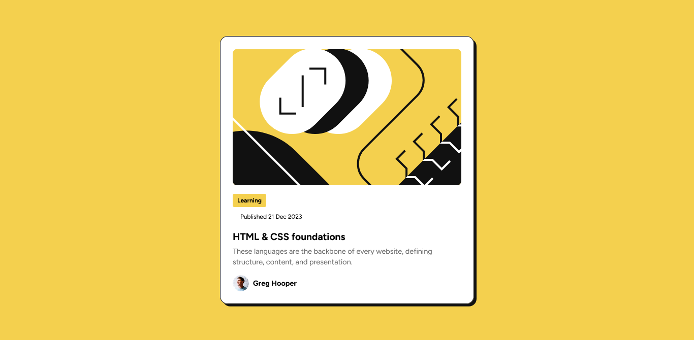

# Frontend Mentor - Blog preview card solution

This is a solution to the [Blog preview card challenge on Frontend Mentor](https://www.frontendmentor.io/challenges/blog-preview-card-ckPaj01IcS). Frontend Mentor challenges help you improve your coding skills by building realistic projects.

## Table of contents

- [Overview](#overview)
  - [The challenge](#the-challenge)
  - [Screenshot](#screenshot)
  - [Links](#links)
- [My process](#my-process)
  - [Built with](#built-with)
  - [What I learned](#what-i-learned)
  - [Continued development](#continued-development)
  - [Useful resources](#useful-resources)
- [Author](#author)
- [Acknowledgments](#acknowledgments)

## Overview

### The challenge

Users should be able to:

- See hover and focus states for all interactive elements on the page

### Screenshot

](./screenshot.jpg)

### Links

- Solution URL: [Add solution URL here](https://your-solution-url.com)
- Live Site URL: [Add live site URL here](https://your-live-site-url.com)

## My process

### Built with

- Semantic HTML5 markup
- CSS custom properties
- Flexbox
- Mobile-first workflow

### What I learned

I learned how to create a responsive blog preview card using CSS Flexbox and media queries. The main challenge was ensuring the layout adapts well across different screen sizes.

```css
@media (max-width: 480px) {
  main {
    width: 95%;
    padding: 1rem;
  }
}
```

### Continued development

I plan to continue improving my CSS skills, especially with animations and transitions to enhance user experience.

### Useful resources

- [MDN Web Docs](https://developer.mozilla.org/en-US/) - Comprehensive documentation for web development.
- [CSS Tricks](https://css-tricks.com/) - Helpful guides and tips on CSS.

## Author

- Frontend Mentor - [@shaheerahmedkhan11](https://www.frontendmentor.io/profile/shaheerahmedkhan11)

## Acknowledgments

Thanks to Frontend Mentor for providing this challenge and to the web development community for sharing useful resources.

